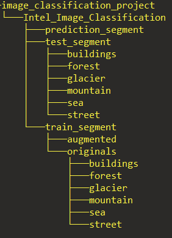

CNN model for "Intel Image Classification" dataset.

1. Code is placed inside code cells inside the CNN_model.ipynb file.
2. To use the code install all the dependencies and run the cells sequentially.
3. To be able to use the model do the following:

   **1.** Dowload the data set into you local folder. Dataset link: https://www.kaggle.com/datasets/puneet6060/intel-image-classification\
   **2.** Change folder`s structure, so it looks like the drawing below\

Dataset:\

